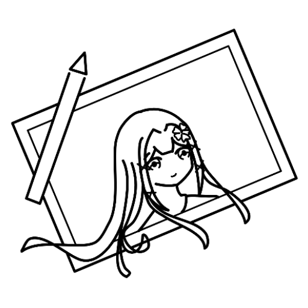

# Nahara's Sketchpad

Companion sketching app for, well, sketching!

Welcome to the source code repository for Nahara's Sketchpad! This repository
houses the app, as well as additional documentations related to Sketchpad, such
as internal file format, app data organization and more.

## Links

- [Source code][source]
- [License][license]
- [Issues][issues]
- [Using Nahara's Sketchpad on computer](./docs/EMULATOR.md)

## About Sketchpad

Nahara's Sketchpad is a companion sketching app for your pen-enabled Android
tablet and phone. Quickly open and sketch when idea arrives, and continue your
idea in other apps with multi-layered PSD and OpenRaster (.ora) exports.

- **Infinite raster canvas**: Powered by tile-based system, Sketchpad
  dynamically expands the canvas to capture your brush strokes, so you can focus
  on sketching and exploring your ideas without having to worry about document
  boundaries or running out of space.

- **GPU-accelerated brush engine**: Take advantage of the device's powerful GPU
  to achieve lower brush lag and power consumption compared to traditional
  CPU-based brush engines.

- **Customizable brushes**: Featuring stamp-based and strip-based brushes, you
  can make your own brush from parameters that can react to stylus pressure and
  tilt, or explore premade brushes that are ready for use right away.

- **Customizable toolbars**: Make Sketchpad yours by configuring and arranging
  toolbars to your own liking, such as move brush toolbar to the right for
  left-handed usage, or combine docked top toolbars and dark theme to hide the
  camera cutouts.

- **100% free**: No ads, no subscriptions, no hidden paywalls and no
  installation fee. Sketchpad is entierly free for use for everything from
  casual doodling to professional works with zero royalty fees.

- **Offline access**: Fully functional offline with no internet access required,
  allowing you to take your sketchpad with you anywhere you go.

Sketchpad is an open-source software licensed under the [MIT License][license].
Visit the [source code repository][source] for technical documentation or
contribute to the project, or visit the [public bug tracker][issues] to report
bugs.

## License

Nahara's Sketchpad is licensed under [MIT License][license].

[source]: https://github.com/Nahara-OSS/sketchpad
[issues]: https://github.com/Nahara-OSS/sketchpad/issues
[magic-brush]: http://github.com/Nahara-OSS/magic-brush
[license]: ./LICENSE
